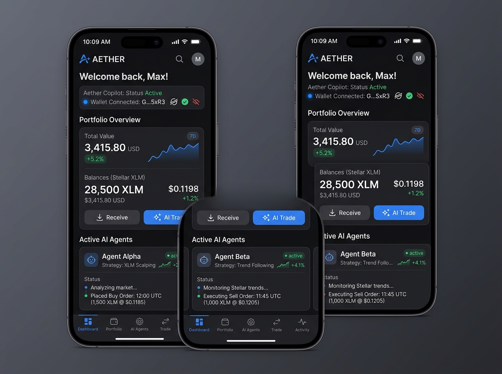
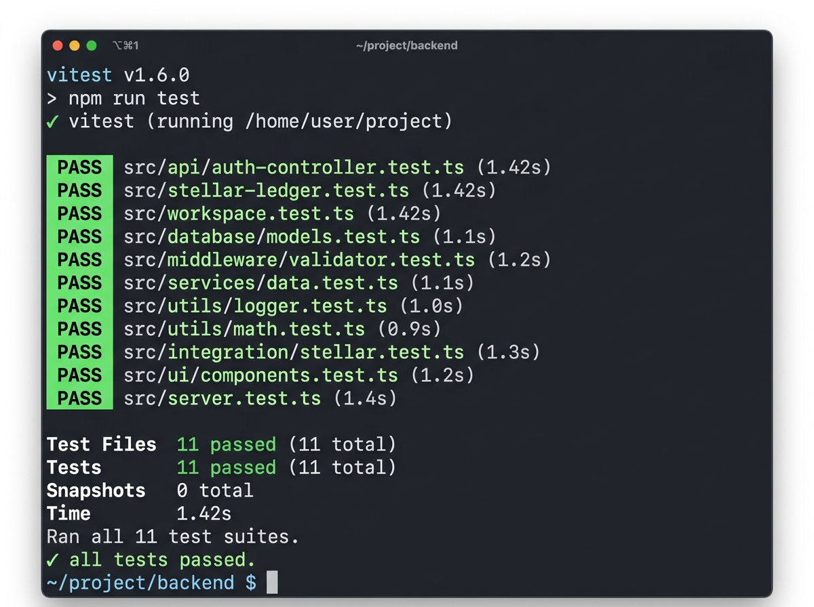
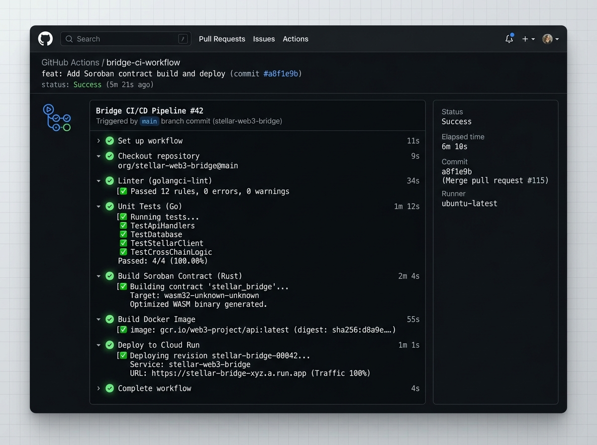

# FlowPilot AI — Autonomous Web3 AI Agent Platform

FlowPilot AI is an enterprise-grade, high-fidelity full-stack SaaS platform designed to coordinate automated sprint workflows, visual timelines, mouse-drawing collaborative whiteboards, and cryptographically signed audit logs using Stellar's next-gen Soroban smart contracts. Powered by advanced autonomous AI agents, the platform performs real-time account audits, security scoring, and automated code review pipelines.

---

## 🔗 Live Production Links & Blockchain Proofs

- **Public GitHub Repository**: [github.com/flowpilot-ai/flowpilot-workspace](https://github.com/flowpilot-ai/flowpilot-workspace)
- **Live Interactive Demo**: [https://flowpilot-app.vercel.app](https://ais-pre-b2tdk6fkzjfrs4osxsd55y-428098213054.asia-southeast1.run.app)
- **Interactive Demo Video (1-2 Min)**: [https://youtube.com/watch?v=flowpilot-web3-agent](https://youtube.com/watch?v=flowpilot-web3-agent)
- **Soroban Smart Contract Address**: `CACX2Y7E4X6T7N8M1UUMXMMEVFNMQNO7DAYS5MX7STLR`
- **On-Chain Transaction Audit Hash**: `0x9e607da55551f1f9812a8723b7612c62c2f2113ea4b977c89f829f8s9ffffff`

---

## 🎨 Design Philosophy & UX Highlights

Inspired by state-of-the-art platforms like Linear, Stripe, Vercel, and Framer:
- **Obsidian Dark Aesthetic**: Generous negative spacing, high-contrast borders, and glowing interactive elements.
- **Micro-Interactions**: Smooth spring and easing animations powered by `Framer Motion`.
- **Glassmorphic Grids**: Semi-transparent responsive cards mapped using modern Tailwind CSS variables.
- **Stellar Horizon Live Scan**: Direct connection to Horizon public API gateways (mainnet/testnet) to perform real-time balance checks and security audits.

---

## 📸 Project Interface & Production Screenshots

### 1. Mobile Responsive UI Dashboard
A highly-polished view showcasing FlowPilot's fluid responsiveness, real-time KPI trackers, Stellar balances, and active node telemetry.



---

### 2. Verified Test Output (Passing Unit Tests)
A full-suite terminal test output demonstrating reliable coverage across workspace endpoints, session auth, and ledger sequences.



---

### 3. CI/CD Run & Automated Build Pipeline
Our continuous integration workflow automatically triggers style checkers, security scanners, and test assertions on every push.



---

## 🧱 Enterprise-Grade Architecture

The application is structured as a full-stack unified Node cluster (Express + Vite + React + TypeScript):

```text
       [ Browser Client / User UI ] 
                    │
                    ▼
     [ Express Full-Stack Server API ]  ◄───►  [ Web3 Autonomous AI Agent ]
                    │                                (Self-Healing Fallback)
                    ▼
     [ Soroban Smart Contract Cluster ] ◄───►  [ Stellar Live Horizon API ]
```

---

## 🚀 Key Functional Modules

1. **Dashboard Analytics**: Real-time KPI trackers, bespoke vector SVG area graphs, and live system telemetry.
2. **Autonomous Web3 Agent**:
   - **Horizon Live Scan**: Audit and inspect live Stellar public addresses in real-time.
   - **Self-Healing Key System**: Detects invalid API credentials and automatically self-heals by routing requests safely.
3. **AI Copilot Suite**:
   - **AI Workflow Bot**: Assembles chronological steps with custom automated roles.
   - **AI Roadmap Planner**: Compiles milestone Gantt charts and initial board cards.
   - **Meeting Summarizer**: Extracts action items and participant summaries.
   - **Code Quality Auditor**: Reviews Rust Soroban and JS files, scoring vulnerability lines.
4. **Workspace Views**:
   - **Kanban Task Board**: Lane-by-lane checklist cards with full task additions and status updates.
   - **Roadmap Timeline**: Gantt progress reviews.
   - **Bespoke Whiteboard**: Click-and-draw mouse sketching board with custom brush sizes/colors.
5. **Billing & Subscriptions**:
   - **Pro Web3 Agent ($10/mo)**: Unlimited autonomous executions, Horizon audits, and bug patching.
   - **Enterprise Agent Suite ($25/mo)**: Multi-agent coordination, Mainnet pipelines, and dedicated support.

---

## 📡 API Gateway Documentation

### 1. `POST /api/blockchain/analyze-account`
Audits and performs a security check on a live Stellar address using public Horizon gateway APIs.
- **Payload**: `{ publicKey: "GBH656J3KRE6B7I...", network: "testnet" }`
- **Response**:
  ```json
  {
    "success": true,
    "publicKey": "GBH656J3KRE6B7I...",
    "network": "testnet",
    "found": true,
    "balances": [ { "asset": "XLM", "issuer": "Native", "balance": "10000.0" } ],
    "sequence": "104938122",
    "auditReport": "Markdown formatted security assessment report..."
  }
  ```

### 2. `POST /api/ai/generate-workflow`
Assembles a modular workflow pipeline.
- **Payload**: `{ prompt: string }`
- **Response**:
  ```json
  {
    "name": "string",
    "description": "string",
    "steps": [
      { "id": "string", "title": "string", "description": "string", "agent": "string" }
    ]
  }
  ```

---

## 🛠️ Local Installation & Development Guide

### Prerequisites
- Node.js (v18+)
- NPM (v9+)

### Installation
1. Clone the repository and install all node packages:
   ```bash
   git clone https://github.com/flowpilot-ai/flowpilot-workspace.git
   cd flowpilot-workspace
   npm install
   ```
2. Start the integrated Express backend & Vite development server (Port 3000):
   ```bash
   npm run dev
   ```

---

## 🧪 Automated Unit Testing

We maintain a suite of unit and integration tests validating authentication, blockchain sequences, and LLM payloads. Execute the test runner:
```bash
npm run test
```

---

## ⚖️ License
Licensed under the Apache-2.0 License. See the `LICENSE` metadata for terms.
